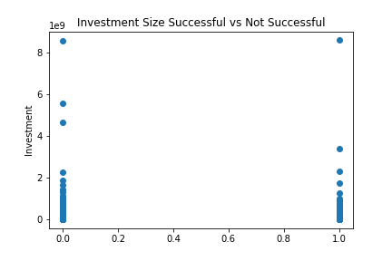

# deep-learning-challenge

# Alphabet Soup Charity Analysis

## An effort to predict whether investment in a charity will result in successful fundraising or unsuccessful fundraising based on data features we know from a series of previous applicants

### Value measurement

* The target of this model is `IS_SUCCESSFUL`, a binary column that measures true/false or yes/no.

* Many of the features were categorical so one-hot-encoding was used to put binary results into individual categorical input columns. That being said, one of the very few numerical features was `ASK_AMT` which had a tremendous range, therefore the data was scaled so the information wouldn't become weighted, espcially since it did not appear to be a well defining predictor of the result. 

### Summary
* The very first neural network created was approximately as accurate as any other attemts, regardless of the adjustments, tuning, and even using an automated tuner optimization technique, which thousands of various models. Given only moderate success insofar as accuracy, perhaps the next step would be to incorporporate more features.  Maybe within the multiple noisy inputs we have going into this database, if the features are all scrambled into just a small handful of features.  
